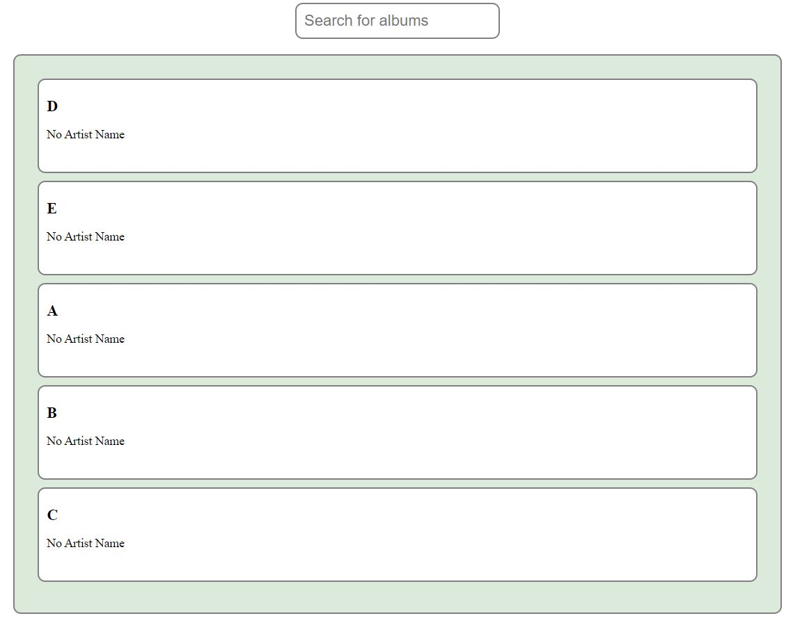
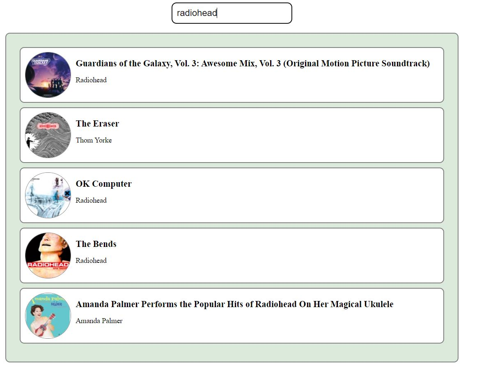

## SPA

This single-page application (SPA) allows suers to search for albums on the Apple Music API and displays the first five alphabetically sorted results in a rotating list in every second The list of albums continues to rotate every second and includes the new search results at the bottom of the list.

## Usage

1. Clone the repository 
2. Install dependencies by running **npm install**  
3. Run **npm start** to start the development server  
4. Navigate to http://localhost:3000 in your browser  
5. Type the name of an album in the search field and hit enter to see the rotating list of their albums
   Functionality  

## Scenario

The application displays a search field and a rotating list of albums.  
The list of albums rotates every second and displays the next five albums in alphabetical order.  
When a user types into the search field, the application queries the Apple Music API for the top five albums by the artist.  
The list of albums continues to rotate every second and includes the new search results at the bottom of the list.

  

